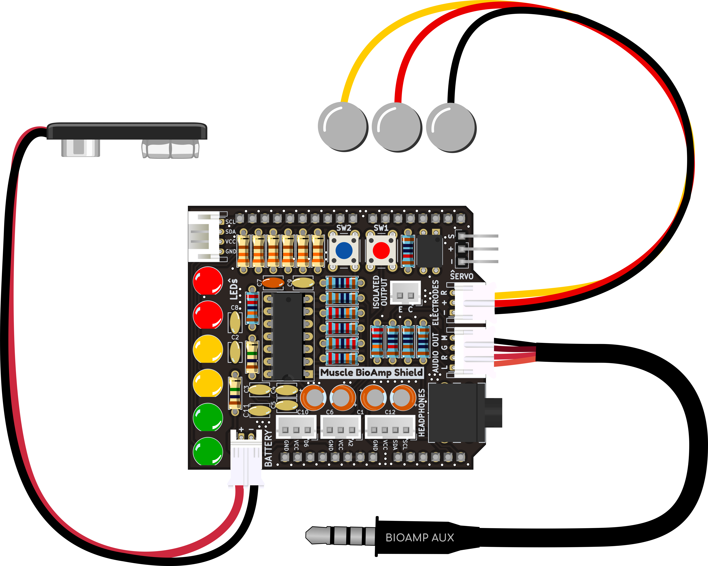
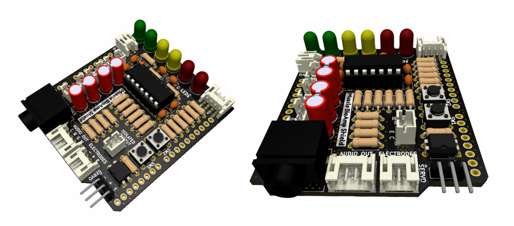
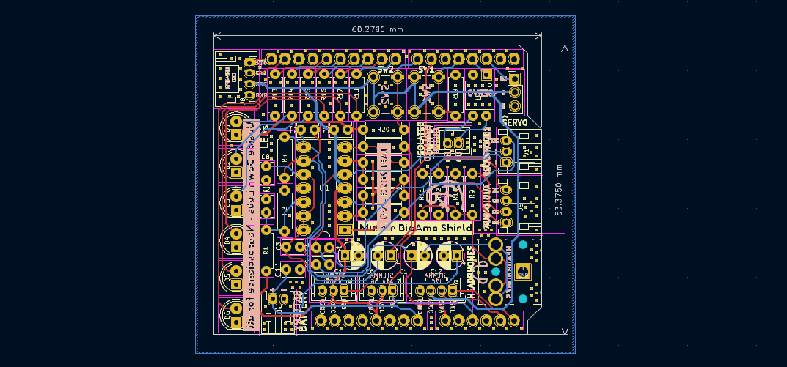

# Muscle BioAmp Shield

 
[-white)](https://store.upsidedownlabs.tech/product/muscle-bioamp-shield-v0-3/)

Muscle BioAmp Shield is an all-in-one Arduino Uno ElectroMyography (EMG) shield for learning neuroscience with ease. It is inspired from Back Yard Brains (BYB) Spiker shield and provides similar features like user buttons & LED Bar. It is perfect for beginners as they can easily stack it on top of Arduino Uno to record, visualize and listen to the muscle signals to make amazing projects in Human-Computer Interface (HCI).

| Assembled | With cables & wires |
| :-------: | :--------: |
|  |  |

## Hardware

Muscle BioAmp Shield has been created using KiCad and all the design files can be found under [hardware](hardware/) folder, including [Interactive BOM](hardware/bom) file. Images below shows a quick overview of the hardware design.

## Features & Specifications

It comes with various plug-and-play options so you can connect hundreds of devices like OLED screens, character displays, accelerometers, and servo controllers to name just a few using the I2C interface.

## License

#### Hardware
CERN Open Hardware License Version 2 - Strongly Reciprocal ([CERN-OHL-S-2.0](https://spdx.org/licenses/CERN-OHL-S-2.0.html)).

#### Software
MIT open source [license](http://opensource.org/licenses/MIT).

#### Documentation:
 This work is licensed under a <a rel="license" href="http://creativecommons.org/licenses/by/4.0/">Creative Commons Attribution 4.0 International License</a>.